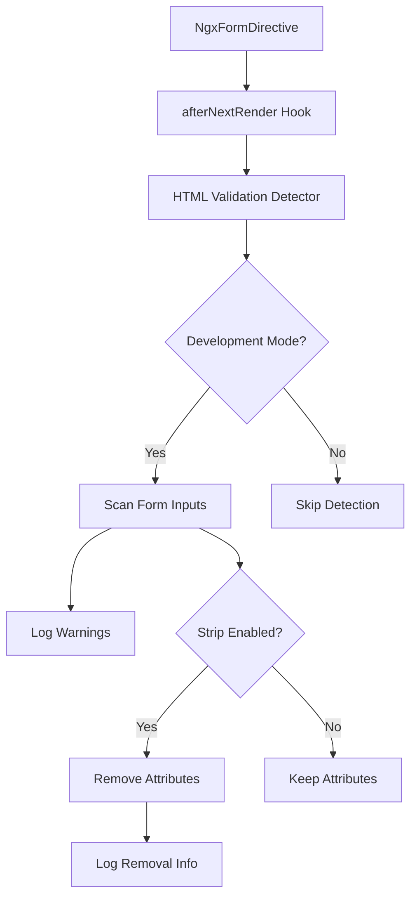

# Product Requirements Document (PRD)

## HTML Validation Interference Detection & Developer Experience Improvements

### Document Information

- **Version**: 1.0
- **Date**: 2025-01-02
- **Target Release**: ngx-vest-forms v2.x
- **Status**: Draft
- **Author**: Development Team

---

## 1. Executive Summary

### Problem Statement

Developers using ngx-vest-forms frequently encounter validation conflicts when HTML validation attributes (`min`, `max`, `required`, `pattern`, etc.) interfere with Vest.js validation, even though the library automatically adds `novalidate`. This creates:

- Confusing error messages ("min" instead of custom Vest messages)
- Inconsistent validation timing between browser and Vest
- Silent validation failures where errors don't display properly
- Poor developer experience with difficult-to-debug issues

### Solution Overview

Implement proactive HTML validation interference detection with:

1. **Development-time warnings** when problematic attributes are detected
2. **Optional automatic attribute stripping** for teams that prefer automation
3. **Enhanced documentation** with clear warnings and examples
4. **Better developer tooling** to prevent and diagnose issues

### Success Metrics

- Reduce HTML validation-related support issues by 80%
- Improve developer onboarding time by 25%
- Increase developer satisfaction scores for form validation experience
- Zero breaking changes for existing users

---

## 2. Background & Context

### Current State Analysis

**Root Cause Identified:**

- HTML validation attributes (`min="18"`, `max="120"`, `required`, `pattern`, etc.) interfere with Vest validation
- Even with `novalidate` attribute, browser validity state affects Angular form controls
- Error messages show generic browser errors ("min") instead of custom Vest messages
- Developers are unaware this is the source of validation issues

**Real-World Impact:**

- Investigation revealed actual production bug in basic-validation example
- Age validation showing "min" instead of "You must be at least 18 years old"
- Conditional field race conditions traced to HTML attribute interference
- Multiple duplicate support tickets for "validation not working"

### Technical Investigation Results

**Evidence from Codebase:**

```typescript
// BEFORE: Problematic HTML that caused actual bugs
<input name="age" [ngModel]="model().age" type="number" min="18" max="120" />
// Result: Shows "min" error instead of Vest custom message

// AFTER: Clean HTML with Vest-only validation
<input name="age" [ngModel]="model().age" type="number" />
// Result: Shows "You must be at least 18 years old" from Vest suite
```

**Browser Behavior Analysis:**

- `novalidate` disables HTML5 validation **submission blocking**
- But HTML attributes still affect `element.validity` state
- Angular's form system reads validity state for error determination
- Creates timing conflicts between browser and Vest validation

---

## 3. Requirements

### 3.1 Functional Requirements

#### 3.1.1 Development-Time Warning System

**Priority**: High
**Epic**: Developer Experience

**Requirements:**

- **NGX-VEST-001**: Detect HTML validation attributes during development
- **NGX-VEST-002**: Log specific warnings with field names and attribute types
- **NGX-VEST-003**: Provide actionable solutions in warning messages
- **NGX-VEST-004**: Include documentation links in warnings
- **NGX-VEST-005**: Only run detection in development mode (`ngDevMode`)

**Acceptance Criteria:**

```typescript
// Given a form with HTML validation attributes
<form ngxVestForm [vestSuite]="suite" [(formValue)]="model">
  <input name="email" required pattern=".+@.+" [ngModel]="model().email" />
  <input name="age" min="18" max="120" [ngModel]="model().age" />
</form>

// When the form is rendered in development mode
// Then the console should show:
[ngx-vest-forms] HTML validation attributes detected that may interfere with Vest.js validation:
Field "email" has 'required' attribute
Field "email" has 'pattern' attribute
Field "age" has 'min' attribute
Field "age" has 'max' attribute

Recommendation: Remove these attributes and define all validation in your Vest suite instead.
See: https://github.com/simplifiedcourses/ngx-vest-forms#html-validation-interference
```

#### 3.1.2 Optional Attribute Stripping

**Priority**: Medium
**Epic**: Developer Experience

**Requirements:**

- **NGX-VEST-006**: Provide optional automatic HTML validation attribute removal
- **NGX-VEST-007**: Support configuration via directive input
- **NGX-VEST-008**: Log when attributes are automatically removed
- **NGX-VEST-009**: Preserve semantic HTML5 input types (email, tel, url) for mobile UX

**Acceptance Criteria:**

```typescript
// Configuration option 1: Per-form basis
<form ngxVestForm
      [vestSuite]="suite"
      [stripHtmlValidation]="true"
      [(formValue)]="model">

// Configuration option 2: Global provider
providers: [
  provideNgxVestFormsCore({
    stripHtmlValidation: true
  })
]

// When enabled, automatically removes:
// - required, min, max, minlength, maxlength, pattern, step
// When enabled, preserves:
// - type="email", type="tel", type="url" (for mobile keyboard UX)
```

#### 3.1.3 Enhanced Documentation

**Priority**: High
**Epic**: Developer Experience

**Requirements:**

- **NGX-VEST-010**: Add critical warnings to README.md
- **NGX-VEST-011**: Update instructions file with comprehensive guidance
- **NGX-VEST-012**: Create troubleshooting section with common scenarios
- **NGX-VEST-013**: Add migration examples for common HTML validation patterns

**Acceptance Criteria:**

- Critical warning section in README with visual emphasis
- Step-by-step examples showing wrong vs. correct approaches
- Troubleshooting guide with symptoms and solutions
- Clear explanation of why HTML validation interferes with Vest

#### 3.1.4 Developer Tooling Integration

**Priority**: Low
**Epic**: Developer Experience

**Requirements:**

- **NGX-VEST-014**: Provide ESLint rule for detecting HTML validation attributes
- **NGX-VEST-015**: Create VS Code snippet for safe form field patterns
- **NGX-VEST-016**: Add schematic for migrating existing forms

### 3.2 Non-Functional Requirements

#### 3.2.1 Performance

- **PERF-001**: Detection should only run in development mode
- **PERF-002**: No performance impact on production builds
- **PERF-003**: Attribute stripping should not affect form initialization timing
- **PERF-004**: Warning system should not block form rendering

#### 3.2.2 Compatibility

- **COMPAT-001**: Zero breaking changes for existing users
- **COMPAT-002**: Backward compatible with all current ngx-vest-forms features
- **COMPAT-003**: Compatible with Angular 19+ and Angular 20.2 features
- **COMPAT-004**: Works with all supported browsers

#### 3.2.3 Accessibility

- **A11Y-001**: Attribute stripping must not remove accessibility attributes
- **A11Y-002**: Preserve ARIA attributes and roles
- **A11Y-003**: Maintain semantic HTML5 input types for assistive technology

#### 3.2.4 Developer Experience

- **DX-001**: Clear, actionable error messages
- **DX-002**: Comprehensive documentation with examples
- **DX-003**: Easy opt-in/opt-out for all features
- **DX-004**: Integration with existing development workflows

---

## 4. Technical Design

### 4.1 Architecture Overview



### 4.2 Implementation Strategy

#### 4.2.1 Core Detection Service

```typescript
// projects/ngx-vest-forms/core/src/lib/services/html-validation-detector.ts

export interface HtmlValidationDetectionResult {
  fieldName: string;
  problematicAttributes: string[];
  element: HTMLElement;
}

export class HtmlValidationDetector {
  private readonly PROBLEMATIC_ATTRIBUTES = [
    'required',
    'min',
    'max',
    'minlength',
    'maxlength',
    'pattern',
    'step',
  ];

  detectProblematicAttributes(
    form: HTMLFormElement,
  ): HtmlValidationDetectionResult[] {
    // Implementation details
  }

  logWarnings(results: HtmlValidationDetectionResult[]): void {
    // Implementation details
  }

  stripAttributes(results: HtmlValidationDetectionResult[]): void {
    // Implementation details
  }
}
```

#### 4.2.2 Enhanced Form Directive

```typescript
// projects/ngx-vest-forms/core/src/lib/directives/form.directive.ts

@Directive({
  selector: 'form[ngxVestForm]',
  host: {
    '[attr.novalidate]': '""',
  },
})
export class NgxFormDirective<TModel = Record<string, unknown>> {
  @Input() stripHtmlValidation = false;

  private readonly detector = inject(HtmlValidationDetector);

  constructor() {
    if (ngDevMode) {
      afterNextRender(
        {
          phase: AfterRenderPhase.Read,
          read: () => this.detectAndHandleHtmlValidation(),
        },
        { injector: this.injector },
      );
    }
  }

  private detectAndHandleHtmlValidation(): void {
    // Implementation details
  }
}
```

#### 4.2.3 Global Configuration

```typescript
// projects/ngx-vest-forms/core/src/lib/providers/core.providers.ts

export interface NgxVestFormsCoreConfig {
  stripHtmlValidation?: boolean;
  enableHtmlValidationWarnings?: boolean;
  rootFormKey?: string;
  errorDisplayMode?: ErrorDisplayMode;
}

export function provideNgxVestFormsCore(
  config: NgxVestFormsCoreConfig = {},
): Provider[] {
  return [
    // Implementation details
  ];
}
```

### 4.3 Documentation Structure

#### 4.3.1 README.md Enhancements

````markdown
## 🚨 Critical: HTML Validation Interference

**AVOID** HTML validation attributes on form controls within `ngxVestForm`:

❌ **WRONG:**

```html
<input name="age" min="18" max="120" required />
```
````

✅ **CORRECT:**

```html
<input name="age" [ngModel]="model().age" />
```

**Why**: HTML validation attributes interfere with Vest validation even with `novalidate`.

**Solution**: Define all validation in your Vest suite:

```typescript
test('age', 'Age must be between 18 and 120', () => {
  enforce(data.age)
    .isNotEmpty()
    .isNumeric()
    .greaterThanOrEquals(18)
    .lessThanOrEquals(120);
});
```

````

#### 4.3.2 Instructions File Updates
```markdown
## Error Prevention Checklist

**CRITICAL Validation Setup:**
- [ ] **No HTML validation attributes** (`min`, `max`, `required`, `pattern`, etc.) on form controls
- [ ] All validation rules defined in Vest suite instead of HTML
- [ ] Form controls use semantic types (`type="email"`) for UX but not validation
````

---

## 5. Implementation Plan

### 5.1 Phase 1: Core Detection (Week 1-2)

**Goal**: Implement basic HTML validation attribute detection and warnings

**Tasks**:

1. Create `HtmlValidationDetector` service
2. Integrate detection into `NgxFormDirective`
3. Implement development-mode warnings
4. Add basic unit tests
5. Update core documentation

**Deliverables**:

- Working detection system with console warnings
- Unit tests with 80%+ coverage
- Updated README with critical warnings

### 5.2 Phase 2: Optional Stripping (Week 3)

**Goal**: Add optional automatic attribute removal feature

**Tasks**:

1. Implement attribute stripping functionality
2. Add configuration options (per-form and global)
3. Preserve semantic HTML5 types
4. Add comprehensive testing
5. Update documentation with configuration examples

**Deliverables**:

- Complete attribute stripping feature
- Configuration API with provider functions
- Updated instructions and examples

### 5.3 Phase 3: Enhanced Documentation (Week 4)

**Goal**: Comprehensive documentation and developer guidance

**Tasks**:

1. Enhance README with prominent warnings
2. Update instructions file with detailed guidance
3. Create troubleshooting section
4. Add migration examples for common patterns
5. Update all example applications

**Deliverables**:

- Complete documentation overhaul
- Fixed example applications
- Troubleshooting guide

### 5.4 Phase 4: Developer Tooling (Week 5-6)

**Goal**: Additional developer tools and quality assurance

**Tasks**:

1. Create ESLint rule for HTML validation detection
2. Develop VS Code snippets
3. Add Angular schematic for form migration
4. Comprehensive E2E testing
5. Performance optimization

**Deliverables**:

- ESLint plugin package
- VS Code extension with snippets
- Angular schematic for migration
- Complete test coverage

---

## 6. Testing Strategy

### 6.1 Unit Testing

```typescript
describe('HtmlValidationDetector', () => {
  it('should detect problematic HTML validation attributes', () => {
    // Test detection of min, max, required, pattern, etc.
  });

  it('should generate appropriate warnings for each attribute type', () => {
    // Test warning message generation
  });

  it('should strip attributes when enabled', () => {
    // Test attribute removal functionality
  });

  it('should preserve semantic HTML5 types', () => {
    // Test that type="email" is preserved
  });
});
```

### 6.2 Integration Testing

```typescript
describe('NgxFormDirective with HTML validation detection', () => {
  it('should show warnings in development mode', () => {
    // Test end-to-end warning system
  });

  it('should not affect production builds', () => {
    // Test that detection is disabled in production
  });

  it('should strip attributes when configured', () => {
    // Test attribute stripping integration
  });
});
```

### 6.3 E2E Testing

```typescript
// tests/html-validation-interference.spec.ts
test.describe('HTML Validation Interference Prevention', () => {
  test('should prevent min/max attribute interference', async ({ page }) => {
    // Test that custom Vest messages appear instead of browser messages
  });

  test('should detect and warn about problematic attributes', async ({
    page,
  }) => {
    // Test console warning detection in development mode
  });
});
```

---

## 7. Risks & Mitigation

### 7.1 Technical Risks

**Risk**: Attribute stripping might break existing CSS selectors

- **Likelihood**: Medium
- **Impact**: High
- **Mitigation**: Document CSS selector implications, provide migration guide

**Risk**: Performance impact from DOM scanning

- **Likelihood**: Low
- **Impact**: Medium
- **Mitigation**: Only run in development mode, optimize scanning algorithm

**Risk**: False positives in detection

- **Likelihood**: Medium
- **Impact**: Low
- **Mitigation**: Comprehensive testing, allow configuration to disable warnings

### 7.2 Adoption Risks

**Risk**: Developers might ignore warnings

- **Likelihood**: Medium
- **Impact**: Medium
- **Mitigation**: Make warnings prominent, provide clear solutions, add tooling integration

**Risk**: Breaking changes for teams with heavy HTML validation usage

- **Likelihood**: Low
- **Impact**: High
- **Mitigation**: Make all features opt-in, provide comprehensive migration guide

---

## 8. Success Criteria

### 8.1 Primary Success Metrics

- **Bug Reduction**: 80% reduction in HTML validation-related support issues
- **Developer Experience**: 25% improvement in onboarding time for new developers
- **Code Quality**: Zero production bugs related to HTML/Vest validation conflicts
- **Adoption**: 60% of existing users adopt warning system within 3 months

### 8.2 Quality Gates

- **Test Coverage**: >90% code coverage for new features
- **Performance**: <1ms detection time in development mode
- **Compatibility**: Zero breaking changes for existing applications
- **Documentation**: Complete documentation with examples for all features

### 8.3 User Feedback Metrics

- **Support Tickets**: Reduction in validation-related support requests
- **GitHub Issues**: Fewer HTML validation interference bug reports
- **Developer Satisfaction**: Improved scores in developer experience surveys
- **Community Engagement**: Positive feedback on warning system usefulness

---

## 9. Future Considerations

### 9.1 Potential Enhancements

- **IDE Integration**: Deep VS Code extension with real-time validation
- **Build-Time Checking**: Webpack/Vite plugin for build-time detection
- **AI-Powered Migration**: Automated migration tools using AST transformation
- **Form Builder**: Visual form builder that prevents HTML validation issues

### 9.2 Maintenance Strategy

- **Regular Updates**: Keep detection patterns updated with new HTML validation attributes
- **Community Feedback**: Iterate based on real-world usage patterns
- **Browser Compatibility**: Monitor browser changes that might affect validation behavior
- **Framework Evolution**: Adapt to Angular framework changes and new features

---

## 10. Appendix

### 10.1 Research References

- [WCAG 2.2 Guidelines](https://www.w3.org/TR/WCAG22/) - Accessibility compliance
- [HTML5 Specification](https://html.spec.whatwg.org/multipage/forms.html) - Form validation behavior
- [Vest.js Documentation](https://vestjs.dev/) - Validation library integration
- [Angular Forms Guide](https://angular.dev/guide/forms) - Angular form system

### 10.2 Competitive Analysis

- **Formik/Yup**: Does not address HTML validation interference
- **React Hook Form**: Minimal HTML validation conflict resolution
- **Angular Reactive Forms**: Manual validation setup required
- **Vue Vuelidate**: Similar issues with HTML validation conflicts

### 10.3 Technical Constraints

- **Angular Version**: Requires Angular 19+ for optimal signal support
- **Browser Support**: Must work with all browsers supported by Angular
- **Bundle Size**: New features must not significantly increase core bundle size
- **TypeScript**: Full TypeScript support required for all new APIs

---

## Document Approval

| Role          | Name | Signature | Date |
| ------------- | ---- | --------- | ---- |
| Product Owner | TBD  |           |      |
| Tech Lead     | TBD  |           |      |
| QA Lead       | TBD  |           |      |
| UX Lead       | TBD  |           |      |

---

**Document Version History**

| Version | Date       | Changes              | Author           |
| ------- | ---------- | -------------------- | ---------------- |
| 1.0     | 2025-01-02 | Initial PRD creation | Development Team |
