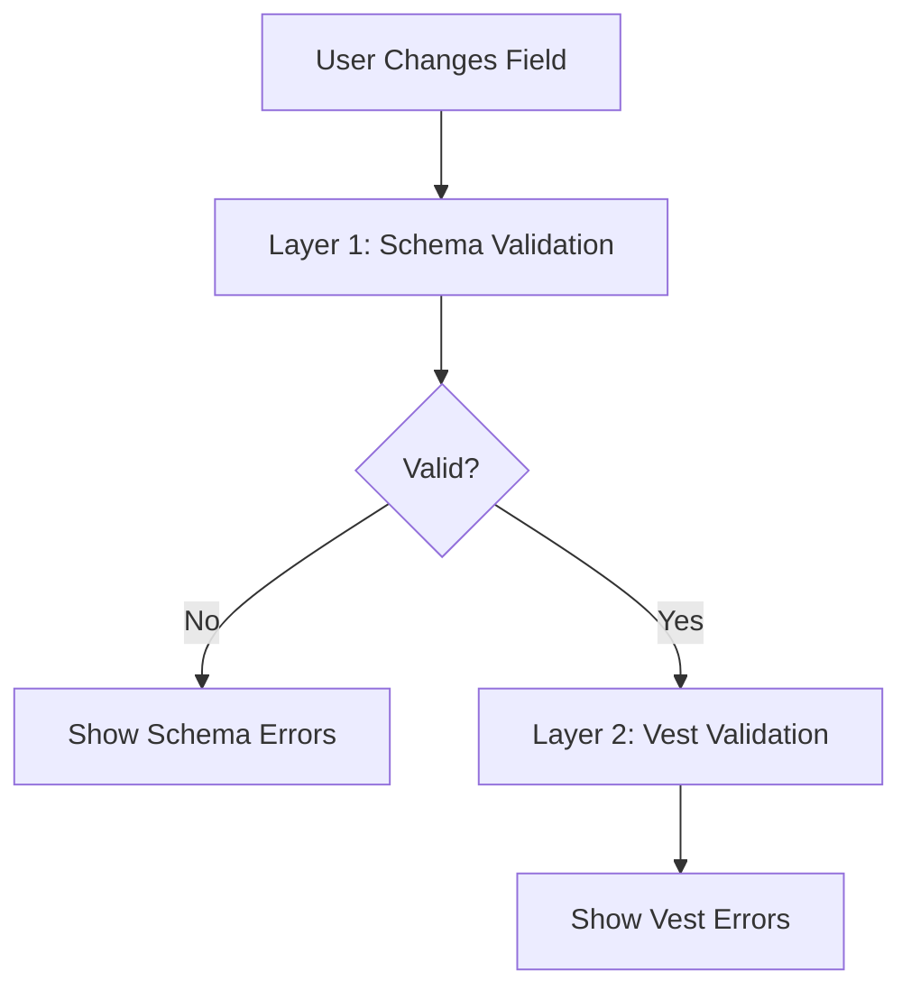

# ngx-vest-forms/schemas

**Optional** utilities for Standard Schema validation libraries (Zod, Valibot, ArkType).

## TL;DR

**You don't need this package for basic validation!** Modern schema libraries (Zod 3.24+, Valibot 1.0+, ArkType 2.0+) natively support StandardSchemaV1. Just pass them directly to `createVestForm`.

This package provides **optional** type guards and type helpers for advanced use cases.

## Overview

This package provides optional utilities for popular validation libraries through the [Standard Schema v1 specification](https://standardschema.dev/). Since modern versions of Zod, Valibot, and ArkType **natively implement StandardSchemaV1**, you can use them **directly** without any adapters!

### What This Package Provides (All Optional)

- ✅ **Type guards** for runtime vendor detection with TypeScript narrowing (`isZodSchema`, `isValibotSchema`, `isArkTypeSchema`, `isStandardSchema`)
- ✅ **Type helpers** for cleaner inference syntax (`InferInput`, `InferOutput`, `ZodInfer`, `ValibotInfer`, `ArkTypeInfer`)
- ✅ **Validation helpers** for standalone use cases (`validateStandardSchema`, `validateStandardSchemaSync`)
- ✅ **Result type guards** for cleaner error handling (`isSuccessResult`, `isFailureResult`)

### What You DON'T Need Anymore

- ❌ Adapter wrappers like `fromZod()`, `fromValibot()` - schemas work natively!
- ❌ Custom validation result transformation - StandardSchemaV1 provides common format
- ❌ This package for basic validation - it's purely optional DX helpers

## Quick Start (No adapters needed!)

```typescript
import { z } from 'zod';
import { createVestForm, staticSafeSuite } from 'ngx-vest-forms/core';

const UserSchema = z.object({ email: z.string().email() });

const form = createVestForm(signal({ email: '' }), suite, {
  schema: UserSchema, // ✅ Works directly - no adapter needed!
});

// Vendor detection (simple approach):
const vendor = UserSchema['~standard'].vendor; // 'zod'
```

## Why No Adapter Wrappers?

**Historical Context:** Earlier versions of schema libraries didn't share a common interface. Adapters were needed to normalize their APIs.

**Modern Reality (2024+):** The [StandardSchema project](https://standardschema.dev/) created a universal specification, and major libraries adopted it:

- **Zod 3.24.0+** implements StandardSchemaV1 natively
- **Valibot 1.0+** implements StandardSchemaV1 natively
- **ArkType 2.0+** implements StandardSchemaV1 natively

**Result:** ngx-vest-forms calls `schema['~standard'].validate(data)` directly on any StandardSchemaV1-compatible schema. No wrapper layer needed!

## When to Use This Package

### ❌ **You DON'T need it for:**

- Basic validation with Zod/Valibot/ArkType
- Simple vendor detection (`schema['~standard'].vendor`)
- Type inference (use library's native types: `z.infer`, `v.InferOutput`, etc.)

### ✅ **You MIGHT need it for:**

- Type guards with TypeScript narrowing to access library-specific properties
- Unified type inference syntax across multiple schema libraries
- Runtime schema introspection (accessing Zod's `_def`, Valibot's `_run`, etc.)

## Supported Libraries

- **Zod** (v3.24.0+)
- **Valibot** (v1.0+)
- **ArkType** (v2.0+)

## Installation

```bash
npm install zod  # or valibot, or arktype
```

No additional installation needed - the schema support is built into `ngx-vest-forms/core`.

## Usage

### With Zod

```typescript
import { Component, signal } from '@angular/core';
import { createVestForm, staticSafeSuite } from 'ngx-vest-forms/core';
import { z } from 'zod';
import { test, enforce } from 'vest';

// 1. Define Zod schema for type validation
const UserSchema = z.object({
  email: z.string().email(),
  age: z.number().min(18),
});

// 2. Define Vest suite for business logic
const userValidations = staticSafeSuite<z.infer<typeof UserSchema>>((data) => {
  test('email', 'Email already taken', async ({ signal }) => {
    const response = await fetch(`/api/check-email/${data.email}`, { signal });
    if (!response.ok) throw new Error();
  });
});

// 3. Create form with both layers
@Component({
  /* ... */
})
export class UserFormComponent {
  private readonly model = signal({ email: '', age: 0 });

  protected readonly form = createVestForm(this.model, userValidations, {
    schema: UserSchema, // Type validation layer
  });
}
```

### With Valibot

```typescript
import * as v from 'valibot';

const UserSchema = v.object({
  email: v.pipe(v.string(), v.email()),
  age: v.pipe(v.number(), v.minValue(18)),
});

type User = v.InferOutput<typeof UserSchema>;

const form = createVestForm(
  model,
  staticSafeSuite<User>((data) => {
    /* business validations */
  }),
  { schema: UserSchema },
);
```

### With ArkType

```typescript
import { type } from 'arktype';

const UserSchema = type({
  email: 'string.email',
  'age?': 'number>=18',
});

type User = typeof UserSchema.infer;

const form = createVestForm(
  model,
  staticSafeSuite<User>((data) => {
    /* business validations */
  }),
  { schema: UserSchema },
);
```

## How It Works

When you provide a `schema` option, ngx-vest-forms runs **two-layer validation**:

1. **Schema Validation (Synchronous)** - Structure and type checking
2. **Vest Validation (Async-capable)** - Business logic and rules



## Vendor Detection

### Simple Approach (Recommended)

Use the StandardSchemaV1 `vendor` property directly - no type guards needed:

```typescript
import { z } from 'zod';

const UserSchema = z.object({ email: z.string().email() });

// ✅ Simple vendor detection
const vendor = UserSchema['~standard'].vendor; // 'zod'

// Display vendor name
console.log(`Using ${vendor} for validation`); // "Using zod for validation"

// Conditional logic based on vendor
if (vendor === 'zod') {
  console.log('Zod schema detected!');
} else if (vendor === 'valibot') {
  console.log('Valibot schema detected!');
} else if (vendor === 'arktype') {
  console.log('ArkType schema detected!');
}
```

### Advanced Approach (With Type Guards)

Use type guards when you need TypeScript narrowing to access library-specific properties:

```typescript
import { isZodSchema, isValibotSchema } from 'ngx-vest-forms/schemas';

function inspectSchema(schema: StandardSchemaV1) {
  if (isZodSchema(schema)) {
    // TypeScript knows this is a Zod schema
    console.log('Zod schema with _def:', schema._def); // Access Zod-specific property
  } else if (isValibotSchema(schema)) {
    // TypeScript knows this is a Valibot schema
    console.log('Valibot schema with _run:', schema._run); // Access Valibot-specific property
  }
}
```

**When to use type guards:**

- ✅ Need to access library-specific properties (`_def`, `_run`, `infer`, etc.)
- ✅ Building generic utilities that work with multiple schema libraries
- ✅ Runtime introspection of schema structure

**When NOT to use type guards:**

- ❌ Just need vendor name for display (`vendor` property is simpler)
- ❌ Regular form usage (direct schema usage is sufficient)
- ❌ Type inference (use library's native types instead)

## Type Safety

All adapters provide full TypeScript inference:

```typescript
const UserSchema = z.object({ email: z.string().email() });

const form = createVestForm(signal({ email: '' }), suite, {
  schema: UserSchema,
});

// ✅ TypeScript knows the model type
form.setEmail('test@example.com'); // OK
form.setEmail(123); // ❌ Type error

// ✅ Runtime validation catches type errors too
form.setEmail('invalid'); // Schema error: "Invalid email"
```

## API Reference

### Convenience Type Aliases

Shorter, more ergonomic type inference across any StandardSchemaV1-compatible library:

```typescript
import type {
  InferInput,
  InferOutput,
  StandardSchema,
} from 'ngx-vest-forms/schemas';
import { z } from 'zod';

const UserSchema = z.object({
  email: z.string().email(),
  age: z.string().transform(Number),
});

// ✅ New: Universal type inference
type UserInput = InferInput<typeof UserSchema>; // { email: string; age: string }
type UserOutput = InferOutput<typeof UserSchema>; // { email: string; age: number }

// vs. library-specific syntax:
type UserInput = z.input<typeof UserSchema>; // Zod
type UserOutput = v.InferOutput<typeof UserSchema>; // Valibot
type UserOutput = typeof UserSchema.infer; // ArkType

// Shorter type annotation
function validate(schema: StandardSchema) {
  // vs. StandardSchemaV1
}
```

**Benefits:**

- ✅ Works with **any** StandardSchemaV1-compatible library
- ✅ Cleaner, shorter syntax
- ✅ Framework-agnostic code

**When to use:** Building generic utilities, multi-library projects, or cleaner code.

### Validation Helpers

Standalone validation functions for use cases **outside of forms**:

#### `validateStandardSchema(schema, value)`

Validates data with automatic async/sync handling:

```typescript
import { z } from 'zod';
import { validateStandardSchema } from 'ngx-vest-forms/schemas';

const UserSchema = z.object({ email: z.string().email() });

const result = await validateStandardSchema(UserSchema, {
  email: 'invalid-email',
});

if (result.issues) {
  // Validation failed
  console.error('Errors:', result.issues);
  // [{ message: 'Invalid email', path: ['email'] }]
} else {
  // Validation succeeded
  console.log('Valid data:', result.value);
}
```

**Use cases:**

- ✅ API request/response validation
- ✅ CLI tool input validation
- ✅ Background job data validation
- ✅ Testing schema behavior

**Don't use for:** Form validation (use `createVestForm` instead)

#### `validateStandardSchemaSync(schema, value)`

Synchronous-only validation (throws if schema is async):

```typescript
import { validateStandardSchemaSync } from 'ngx-vest-forms/schemas';

try {
  const result = validateStandardSchemaSync(schema, data);
  if (result.issues) {
    console.error('Validation failed:', result.issues);
  } else {
    console.log('Valid data:', result.value);
  }
} catch (error) {
  // TypeError: Schema validation must be synchronous
  console.error('Schema uses async validation!', error);
}
```

**Use cases:**

- ✅ Performance-critical paths
- ✅ Constructors or synchronous event handlers
- ✅ When you **know** the schema is synchronous

**Throws:** `TypeError` if the schema performs asynchronous validation

### Result Type Guards

Narrow StandardSchemaV1 result types for cleaner error handling:

#### `isSuccessResult(result)`

Type guard for successful validation:

```typescript
import {
  validateStandardSchema,
  isSuccessResult,
} from 'ngx-vest-forms/schemas';

const result = await validateStandardSchema(schema, data);

if (isSuccessResult(result)) {
  // TypeScript knows result.value exists and result.issues is undefined
  console.log('Valid data:', result.value);
  return result.value;
} else {
  // TypeScript knows result.issues exists
  console.error('Validation errors:', result.issues);
  throw new Error('Invalid data');
}
```

#### `isFailureResult(result)`

Type guard for failed validation:

```typescript
import {
  validateStandardSchema,
  isFailureResult,
} from 'ngx-vest-forms/schemas';

const result = await validateStandardSchema(schema, data);

if (isFailureResult(result)) {
  // TypeScript knows result.issues exists
  const errorMessages = result.issues.map((issue) => issue.message);
  console.error('Errors:', errorMessages);
} else {
  // TypeScript knows result.value exists
  console.log('Success:', result.value);
}
```

**Benefits:**

- ✅ Type-safe result handling
- ✅ No need for manual type assertions
- ✅ Cleaner than checking `'issues' in result`

### Generic Type Guard

Check if any value is a StandardSchemaV1-compatible schema:

```typescript
import { isStandardSchema } from 'ngx-vest-forms/schemas';

function processSchema(value: unknown) {
  if (isStandardSchema(value)) {
    // TypeScript knows value is StandardSchemaV1
    console.log('Vendor:', value['~standard'].vendor);
    console.log('Version:', value['~standard'].version);

    const result = value['~standard'].validate(data);
    // ...
  }
}
```

**When to use:** Generic utilities that accept unknown values and need to detect schemas

### Vendor-Specific Type Guards (Optional)

Use these when you need TypeScript narrowing to access library-specific properties:

```typescript
import {
  isZodSchema,
  isValibotSchema,
  isArkTypeSchema,
} from 'ngx-vest-forms/schemas';

function inspectSchema(schema: StandardSchemaV1) {
  if (isZodSchema(schema)) {
    // TypeScript knows this is a Zod schema - access Zod-specific properties
    console.log('Zod schema with _def:', schema._def);
  } else if (isValibotSchema(schema)) {
    // TypeScript knows this is a Valibot schema
    console.log('Valibot schema with _run:', schema._run);
  } else if (isArkTypeSchema(schema)) {
    // TypeScript knows this is an ArkType schema
    console.log('ArkType schema with infer:', schema.infer);
  }
}
```

**When to use:**

- ✅ Need to access library-specific properties (`_def`, `_run`, `infer`, etc.)
- ✅ Building generic utilities that work with multiple schema libraries
- ✅ Runtime introspection of schema structure

**When NOT to use:**

- ❌ Just need vendor name for display (use `schema['~standard'].vendor` instead)
- ❌ Regular form usage (direct schema usage is sufficient)
- ❌ Type inference (use library's native types instead)

### Library-Specific Type Helpers

Cleaner type inference syntax for specific libraries:

```typescript
// Zod
import type { ZodInfer } from 'ngx-vest-forms/schemas';
const UserSchema = z.object({ name: z.string() });
type User = ZodInfer<typeof UserSchema>; // Same as z.infer<typeof UserSchema>

// Valibot
import type { ValibotInfer } from 'ngx-vest-forms/schemas';
const UserSchema = v.object({ name: v.string() });
type User = ValibotInfer<typeof UserSchema>; // Same as v.InferOutput<typeof UserSchema>

// ArkType
import type { ArkTypeInfer } from 'ngx-vest-forms/schemas';
const UserSchema = type({ name: 'string' });
type User = ArkTypeInfer<typeof UserSchema>; // Same as typeof UserSchema.infer
```

**Note:** For library-agnostic code, use `InferInput` and `InferOutput` instead (works with any StandardSchemaV1 schema).

## Learn More

- [Standard Schema Specification](https://standardschema.dev/)
- [Zod Documentation](https://zod.dev/)
- [Valibot Documentation](https://valibot.dev/)
- [ArkType Documentation](https://arktype.io/)
